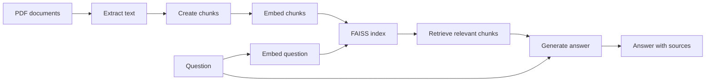
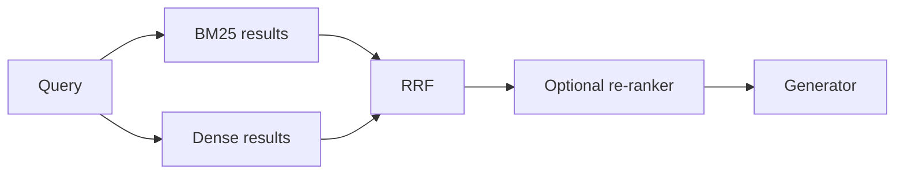
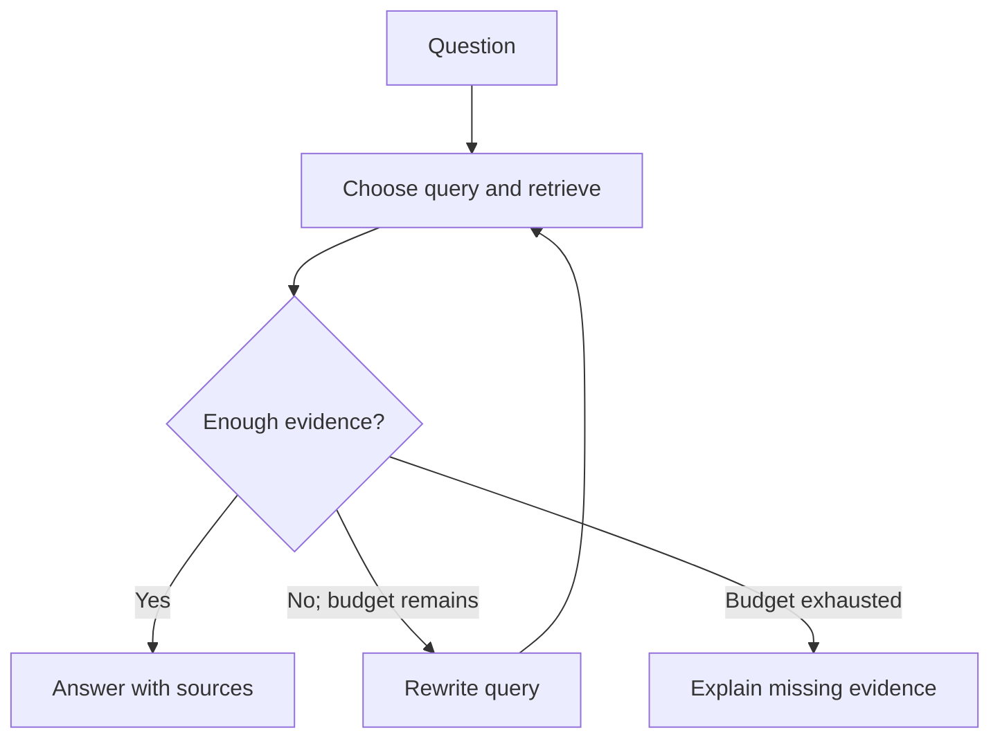

# Session 8 pre-reading: Building LLM Apps with APIs and RAG

**Monday 14 September 2026 · Week 8**

In Session 7, you explored prompting and evaluated model responses. This session turns those ideas into Python applications: call a model, stream its answer, retrieve evidence from PDFs, and present the result in a chat interface.

**Before class: spend 15–20 minutes on sections 1–5 and the [vector similarity guide](vector_similarity.md).** Check the [README setup instructions](README.md#setup) before Monday. Sections 6–9 are optional deeper reading; you do not need to memorise the equations or install extra search services.

**No OpenAI API key?** Reuse the local Ollama setup discussed in Session 7, with a model such as Llama or gpt-oss that runs on your machine. Download and test your model before class. Notebook 01 includes an Ollama provider comparison, and local embedding examples also run without an OpenAI key. The OpenAI-specific examples and current Streamlit RAG app still require OpenAI access; the provider selector does not convert those activities to Ollama. Read those examples and follow the demonstrations if you do not have a key. See the [local setup instructions](README.md#using-ollama-without-an-openai-key).

## 1. What we will build

Our main build is a Streamlit chat app that answers questions about a small collection of handbook and benefits PDFs. You will see the complete retrieval-augmented generation (RAG) pipeline, including the evidence retrieved for each question.

| Activity | File | Main idea |
|---|---|---|
| Call an LLM | `notebooks/01_llm_api_access.ipynb` | OpenAI SDK, Chat Completions, Responses, structured output, images, optional provider comparisons |
| Compare text meaning | `notebooks/02_embeddings_and_similarity.ipynb` | Embeddings, cosine similarity, semantic search |
| Stream an answer | `notebooks/03_streaming_responses.ipynb` | Response events and incremental text |
| Retrieve from PDFs | `notebooks/04_rag_with_pdfs_and_faiss.ipynb` | Parsing, chunking, indexing, retrieval, grounded generation |
| Add a chat interface | `notebooks/05_gradio_chat_demo.ipynb` | Conversation history and streaming in Gradio |
| Give the model tools | `notebooks/06_tool_use.ipynb` | Function calling, built-in tools, retrieval as a tool |
| Combine the components | `06_streamlit_rag_app.py` | Streaming RAG chat with sources and an editable system prompt |
| Let the model choose | `07_streamlit_agentic_rag_app.py` | Optional PDF search, weather, and date/time tools in a bounded loop |

The second Streamlit app contrasts the fixed RAG pipeline with **retrieval as a tool**. A greeting can receive a direct response; a company-policy question can trigger PDF search. Weather and clock tools provide other choices. Inspect the tool trace: did the model need a tool, choose the right one, and use its result correctly? The app retains conversation and tool results for follow-ups. Both Streamlit apps currently require OpenAI API access.

The notebooks are designed for hands-on work together. The managed vector stores and advanced retrieval methods later in this guide provide context for the local FAISS build.

## 2. APIs, providers, and streaming

An **API** lets your program send a request to a model service and receive a response. An **SDK** is a library that makes those requests easier to write. The OpenAI Python SDK provides methods such as `client.responses.create(...)` and `client.embeddings.create(...)`.

We compare two generation interfaces:

- **Chat Completions:** send a list of messages with roles such as `system`, `user`, and `assistant`; read the returned message.
- **Responses:** send input and instructions; inspect text output or structured events, including requests to use tools.

The notebooks use OpenAI directly. Optional Ollama examples run models locally through a compatible endpoint. Changing the base URL, model, and credentials can let you reuse request code, but compatibility depends on the endpoint and feature. The optional Claude comparison uses Anthropic's SDK. [Ollama compatibility reference](https://docs.ollama.com/api/openai-compatibility).

**Streaming** delivers pieces of output as they become available. Your code iterates over events and updates the interface. In the Responses examples, `response.output_text.delta` carries another piece of text. Gradio receives the accumulated answer from a generator; Streamlit can consume text pieces through `st.write_stream`. Streaming changes when the user sees output, not whether that output is correct.

**Structured output** constrains the response to a schema, such as a list of products with names and prices. Pydantic expresses that schema in Python and validates returned data. A valid structure does not guarantee correct values, and applications still need to handle refusals or incomplete responses. [Structured outputs](https://developers.openai.com/api/docs/guides/structured-outputs).

## 3. Embeddings and similarity

An **embedding** represents text as a numerical vector. A retrieval model aims to place a relevant passage near its query, even when their wording differs. For example, a question about “time off” may retrieve a passage about “annual leave”. This is a learned relationship, not a guarantee of relevance.

Keep query and document vectors in the same embedding space: use the same model and its recommended encoding settings. Changing the model requires re-embedding documents and rebuilding the index; matching dimensions alone is insufficient.

**Cosine similarity** compares directions. **Dot product** also depends on vector lengths unless both vectors are normalised. **L2 distance** measures separation, so smaller values mean nearer vectors. Read [Vector Similarity](vector_similarity.md) for the equations, a worked example, and the relationship to the session's FAISS index.

A similarity score is not a probability that an answer is correct. There is no universal threshold such as “0.85 means relevant” across embedding models and datasets. Inspect retrieved passages and evaluate with questions from your use case.

## 4. RAG is a pipeline

A model's training data does not necessarily contain your organisation's documents or latest policies. RAG supplies selected evidence at answer time without changing the model's weights.

There are two stages:

1. **Indexing:** extract document text, split it into chunks, attach source metadata, embed the chunks, and store the vectors.
2. **Answering:** embed a question, retrieve nearby chunks, and send the question and evidence to the generator.

**Parsing matters.** A PDF can contain scanned images, columns, tables, or repeated headers. Inspect extracted text before indexing it. Our `pypdf` example reads text-based PDFs; it does not perform OCR.

**Chunking matters.** Small chunks can lose context; large chunks can bring in unrelated material. Overlap can preserve content around boundaries but also creates duplication. The teaching code uses **500-character chunks with 100-character overlap**. These are characters, not tokens, and the values are a starting point rather than an optimum. More advanced splitters can respect paragraphs, headings, tables, or token budgets.

**Sources matter.** Keep the filename and chunk identifier alongside each vector so you can inspect the evidence. The app displays retrieved chunks; check that the answer's citations actually support its claims.

Lewis et al.'s [RAG paper](https://arxiv.org/abs/2005.11401) combined a neural retriever with a sequence-to-sequence generator and demonstrated gains on knowledge-intensive tasks. Our notebook teaches the broader retrieve-then-generate pattern. Retrieval can improve factual grounding, but wrong or incomplete evidence can still produce a wrong answer.

## 5. How to judge whether RAG works

Start with questions that represent the intended use. A simple policy lookup, a comparison across documents, and a question whose answer is absent test different weaknesses.

| Check | What to inspect |
|---|---|
| Extraction | Is the relevant passage readable after PDF parsing? |
| Retrieval | Do the top-k chunks contain the evidence needed to answer? |
| Grounding | Does each factual claim follow from the retrieved evidence? |
| Completeness | Does the answer address all parts of the question? |
| Abstention | Does the app acknowledge missing information? |
| Practicality | Are response time and API usage acceptable? |

The supplied `data/questions.json` has **seven questions with expected signals and source-document hints**, not seven authoritative answer strings. Compare the same question with and without retrieval. An honest “I do not have enough information” can be the correct response; a fluent answer or plausible citation alone is not evidence of success.

For larger evaluations, label relevant passages and calculate retrieval metrics such as recall@k or reciprocal rank. Evaluate answer quality separately. This connects directly to Session 7's evaluation work.

Before class, consider:

- Why might keyword search retrieve a product code more reliably than semantic search?
- What happens if a sentence is split across two chunks?
- Can a high similarity score tell you whether a cited policy is current?
- When should the app say that it cannot answer?

## 6. Deeper reading: retrieval approaches

### BM25: lexical retrieval

BM25 scores lexical matches using term frequency, term rarity, and document length. An inverted index makes it possible to retrieve candidates without scanning every document. It is a useful baseline for names, identifiers, and specialist terminology. Without synonym expansion, a query containing only “physician” need not match a passage containing only “doctor”.

One common formulation is:

$$\operatorname{BM25}(D,Q)=\sum_{q_i\in Q}\operatorname{IDF}(q_i)\frac{f(q_i,D)(k_1+1)}{f(q_i,D)+k_1(1-b+b|D|/\operatorname{avgdl})}$$

$$\operatorname{IDF}(q_i)=\log\left(1+\frac{N-n(q_i)+0.5}{n(q_i)+0.5}\right)$$

Here, $f$ counts a term in a document, $N$ counts documents, $n$ counts documents containing the term, and `avgdl` is average document length. The parameter $k_1$ controls saturation of repeated terms; $b$ controls length normalisation. Values such as $k_1=1.2$ and $b=0.75$ are starting settings to evaluate, not universal requirements. See Robertson and Zaragoza's [BM25 reference](https://doi.org/10.1561/1500000019).

### Static word embeddings and contextual text embeddings

Static embeddings such as Word2Vec or GloVe assign a word a fixed vector. They draw on the distributional idea that words used in similar contexts tend to have related meanings. A single word vector cannot distinguish “model” in fashion from “model” in machine learning without additional context handling.

Sentence embedding models instead encode a sentence or passage. A **bi-encoder** processes the query and passage separately, allowing passage vectors to be calculated before any query arrives. Transformer architecture, pooling, training objectives, and query/document instructions vary by model. Mean pooling over a transformer encoder is one common design, not a requirement for every embedding model. [Sentence-BERT](https://aclanthology.org/D19-1410/) provides the foundational comparison.

When selecting a model, consider domain, language, retrieval accuracy, latency, memory, and embedding dimensions. Benchmark results such as [MTEB](https://arxiv.org/abs/2210.07316) can inform a shortlist; evaluate candidates on your own questions. [Matryoshka-trained models](https://arxiv.org/abs/2205.13147) support shorter embedding prefixes with a quality/storage trade-off. This does not mean arbitrary embeddings can be truncated safely, or that vector magnitude necessarily carries meaning.

### Re-ranking with cross-encoders

A cross-encoder scores a query and candidate passage jointly. In a BERT-style implementation the input resembles `[CLS] query [SEP] passage [SEP]`, allowing attention across both texts. Because that score depends on the query, it cannot be precomputed once per document.

A common pattern retrieves perhaps 100 candidates cheaply, then re-ranks them to choose a few passages for generation. Joint scoring can improve relevance, but adds latency and cannot recover a passage missing from the candidate set. Some re-rankers accept instructions describing ranking priorities. Compare the improvement against the extra compute on your workload. [Retrieve and re-rank](https://www.sbert.net/examples/sentence_transformer/applications/retrieve_rerank/README.html).

### Hybrid search and reciprocal rank fusion

Hybrid retrieval combines lexical and dense results. This can cover both exact terms and paraphrases. **Reciprocal rank fusion (RRF)** combines ranks rather than incompatible raw scores:

$$\operatorname{RRF}(d)=\sum_{s:d\in L_s}\frac{1}{k+\operatorname{rank}_s(d)}$$

Ranks start at 1. A document missing from a list contributes zero for that list. The constant $k$ dampens the influence of very high ranks; 60 is a common setting and is distinct from the number of passages retrieved. With $k=60$, ranks 1 and 4 give a score of $1/61+1/64\approx0.0320$.

Hybrid search plus re-ranking is a useful candidate to compare against simpler baselines. It does not guarantee a gain on every corpus. More elaborate approaches such as GraphRAG, ColBERT, or SPLADE should address a measured limitation rather than add complexity by default. See [RRF in Azure AI Search](https://learn.microsoft.com/en-us/azure/search/hybrid-search-ranking) and the [original RRF paper](https://doi.org/10.1145/1571941.1572114).

## 7. Deeper reading: vector stores

A vector index searches embeddings; a full vector-store service may also manage source text, metadata, ingestion, and persistence. In our local build, FAISS holds vectors while Python structures hold the source chunks.

**FAISS** is a similarity-search library. Flat indexes perform exact comparisons against stored vectors. IVF narrows search to selected clusters, while HNSW navigates a proximity graph. Approximate indexes trade some recall for efficiency. FAISS does not generate embeddings or provide BM25 itself; a hybrid pipeline needs a separate lexical retriever and result fusion. The session uses exact `IndexFlatL2` to keep the mechanics visible. [FAISS documentation](https://github.com/facebookresearch/faiss/wiki).

**OpenAI vector stores** manage file ingestion, chunking, embedding, and indexing. The Responses API can use the `file_search` tool to retrieve evidence. Managed retrieval supports semantic and keyword search, with ranking options, metadata filters, and configurable chunking. OpenAI also documents hybrid RRF weights in its retrieval interface. These controls differ from choosing and operating a FAISS index yourself. [Retrieval guide](https://developers.openai.com/api/docs/guides/retrieval).

**Azure AI Search** supports keyword and vector retrieval in one service, RRF fusion, and optional semantic re-ranking. Metadata filtering and correctly implemented document-level permissions matter for enterprise use. Search filters alone do not define who is authorised to read a document. [Hybrid search overview](https://learn.microsoft.com/en-us/azure/search/hybrid-search-overview).

| Capability | FAISS | OpenAI vector stores | Azure AI Search |
|---|---|---|---|
| Dense retrieval | Yes | Managed | Managed |
| Keyword retrieval | Separate component | Managed | BM25 |
| Hybrid fusion | Assemble separately | Managed; retrieval API exposes weights | Built-in RRF |
| Re-ranking | Separate component | Managed ranking controls | Optional semantic ranker |
| Embedding creation | Your application | Managed | Integrated or supplied vectors |
| Storage and operation | Your application | Managed service | Managed service |
| Session role | Hands-on implementation | Conceptual comparison | Conceptual comparison |

Choose according to control, operational effort, data requirements, and measured quality. No Azure subscription or managed vector store is required for the core exercises.

## 8. Deeper reading: agentic retrieval

In a fixed RAG pipeline, each question follows the same retrieval step. In an agentic workflow, a model can choose a search tool, rewrite its query, inspect results, and search again. Notebook 06 introduces this through function calling and a retrieval tool; Session 9 develops agents further.

Repeated retrieval can help questions requiring several pieces of evidence. Query rewriting can also help lexical retrieval bridge vocabulary differences. Neither improvement is guaranteed: extra calls increase latency and cost, and a model may stop too early or pursue the wrong evidence. Limit iterations and compare against the fixed pipeline using the same evaluation questions. An agent's self-assessment is not a ground-truth accuracy measure or a guaranteed upper bound.

Research examples include [IRCoT](https://aclanthology.org/2023.acl-long.557/), which interleaves reasoning and retrieval, and [Self-RAG](https://arxiv.org/abs/2310.11511), which learns retrieval and critique decisions.

## 9. Deeper reading: operating a RAG system

Scope the questions before choosing infrastructure. Exact lookups, paraphrases, multi-document comparisons, and multi-hop questions need different evidence. Set acceptable response time, API cost, and error tolerance, then measure them.

Preserve metadata such as document version and source. Filter irrelevant or inaccessible material before it can enter the model context. Larger collections introduce more distractors; metadata, chunking, retrieval tuning, and re-ranking can all help. Small corpora can fit in memory, while persistence, update frequency, concurrency, and access requirements determine whether a managed service is useful.

Treat retrieved text as evidence, not executable instructions. A document can be outdated, incorrect, or contain malicious instructions. The teaching app demonstrates the pipeline; production use requires stronger permissions, error handling, monitoring, and evaluation.

For an optional broader discussion, watch the supplied [RAG Deep Dive video](https://www.youtube.com/watch?v=AS_HlJbJjH8). Use the linked papers and documentation above for the technical details.
